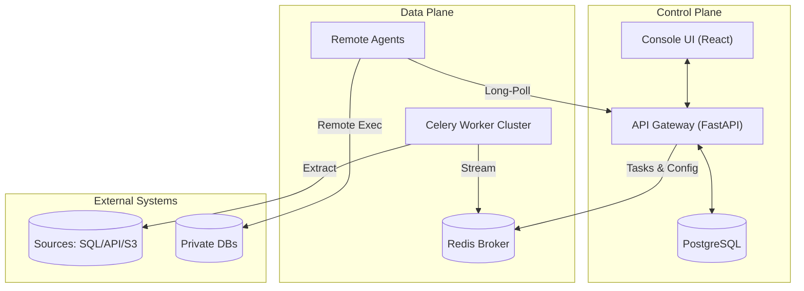

# SynqX - The Universal ETL Engine


**SynqX** is an open-source, production-ready platform designed to simplify the orchestration of complex data workflows. By treating pipelines as **versioned, immutable logic objects** and providing deep, **real-time observability**, SynqX ensures data reliability at scale.

## Mission

To eliminate the "Black Box" nature of traditional ETL. SynqX provides engineers with high-fidelity visibility into their data's journey—from extraction to destination—transforming fragile scripts into robust, observable engineering assets.

---

## System Architecture

SynqX employs a decoupled, event-driven architecture designed for high availability and horizontal scalability.



---

## Developer Quick Start

We provide a unified CLI tool `synqx.py` to manage the entire development lifecycle.

### Prerequisites
*   Python 3.9+
*   Node.js 18+
*   PostgreSQL 15+ (Running locally or via Docker)
*   Redis 7+ (Running locally or via Docker)
*   `uv` (fast Python package manager) recommended

### 1. Installation
Clone the repository and install all dependencies (Backend, Agent, Frontend, Libraries) with a single command:

```bash
git clone https://github.com/your-org/synqx.git
cd synqx

# Installs venvs, dependencies, and links internal libraries
./scripts/synqx.py install
```

### 2. Development
Start the full stack (API, Worker, Scheduler, Frontend):

```bash
# Start Core Stack
./scripts/synqx.py start

# Start Core Stack + Local Agent
./scripts/synqx.py start --agent
```

*   **UI:** [http://localhost:5173](http://localhost:5173)
*   **API Docs:** [http://localhost:8000/docs](http://localhost:8000/docs)

### 3. Management
Use the CLI to manage services and logs:

```bash
# Check status of all services
./scripts/synqx.py status

# Tail logs (Ctrl+C to exit)
./scripts/synqx.py logs api      # backend logs
./scripts/synqx.py logs worker   # worker logs
./scripts/synqx.py logs agent    # agent logs

# Restart everything
./scripts/synqx.py restart

# Stop everything
./scripts/synqx.py stop
```

### 4. Database Operations
Manage database migrations via the unified CLI:

```bash
# Apply pending migrations
./scripts/synqx.py db migrate

# Create new revision (after model changes)
./scripts/synqx.py db revision -m "add_new_table"
```

---

## Agent Management & Release

The SynqX Agent is designed to be **portable and self-contained**.

### Building the Portable Agent
To generate a release artifact for remote deployment:

```bash
# Builds 'synqx-agent-portable.tar.gz' in the root directory
./scripts/synqx.py build agent
```

This artifact contains the agent code, all internal dependencies (bundled as wheels), and an installation script. The Backend API automatically serves this file to users via the "Download Portable Installer" button in the UI.

### Release Versioning
To bump versions across the monorepo and rebuild the agent:

```bash
# Bump patch version (1.0.0 -> 1.0.1) and rebuild
./scripts/synqx.py release bump patch

# Bump minor version (1.0.0 -> 1.1.0) and rebuild
./scripts/synqx.py release bump minor
```

---

## Project Structure

| Module | Description | Path |
| :--- | :--- | :--- |
| **Backend** | Python/FastAPI engine, Celery worker cluster, Vault security. | [`/backend`](./backend) |
| **Frontend** | Premium React-based Console UI with a visual DAG editor. | [`/frontend`](./frontend) |
| **Agent** | Remote execution unit for isolated environments. | [`/agent`](./agent) |
| **Libs** | Shared internal libraries (`synqx-core`, `synqx-engine`). | [`/libs`](./libs) |
| **Scripts** | Unified lifecycle management CLI. | [`/scripts`](./scripts) |

---

## Contributing

We welcome contributions! Please see our [CONTRIBUTING.md](CONTRIBUTING.md) for details on how to submit pull requests, report issues, and request features.

## License

This project is licensed under the MIT License - see the [LICENSE](LICENSE) file for details.
