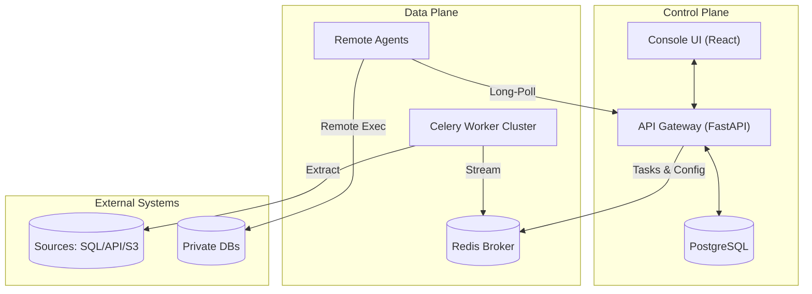

# SynqX - The Universal ETL Engine


**SynqX** is an open-source, production-ready platform designed to simplify the orchestration of complex data workflows. By treating pipelines as **versioned, immutable logic objects** and providing deep, **real-time observability**, SynqX ensures data reliability at scale.

---

## 🏗️ System Architecture

SynqX employs a decoupled, event-driven architecture designed for high availability and horizontal scalability.

*   **Control Plane:** React-based Console (UI) and FastAPI Gateway (API) managing state in PostgreSQL.
*   **Data Plane:** Distributed Celery Workers (Local) and Portable Agents (Remote) executing tasks via Redis.



---

## 🛠️ Tech Stack

### Backend
- **Framework:** FastAPI (Python 3.13+)
- **Task Queue:** Celery + Redis
- **ORM/Migrations:** SQLAlchemy 2.0 + Alembic
- **Package Management:** `uv` (fast, deterministic)

### Frontend
- **Framework:** React 19 + TypeScript
- **Styling:** Tailwind CSS v4 + Shadcn/ui
- **State Management:** Zustand + React Query
- **Canvas:** React Flow (Visual Pipeline Designer)

---

## 🚀 Developer Quick Start

For a detailed walkthrough of the local environment requirements and troubleshooting, see the [Local Setup Guide](docs/LOCAL_SETUP.md).

### 1. Installation
```bash
git clone https://github.com/your-org/synqx.git
cd synqx

# Install venvs, dependencies, and link internal libraries
./scripts/synqx.py setup
```

### 2. Local Development
```bash
# Start API, Worker, and Frontend
./scripts/synqx.py start

# Start with a Local Agent for testing
./scripts/synqx.py start --agent
```
- **Console UI:** `http://localhost:5173`
- **API Docs:** `http://localhost:8000/docs`

---

## ⚙️ Configuration

SynqX uses a flexible configuration system that supports both local development and containerized environments.

### Environment Variables
Copy the templates to start:
- `backend/.env.example` -> `backend/.env`
- `frontend/.env.example` -> `frontend/.env`

### Dynamic Connection Strings
The backend is designed for **Kubernetes-native** deployment. If `DATABASE_URL` is not provided, it will automatically construct it using:
- `DATABASE_HOST`, `DATABASE_PORT`, `DATABASE_USERNAME`, `DATABASE_PASSWORD`, `DATABASE_NAME`

---

## 📦 Deployment

### Docker
Build the stack using the provided Dockerfiles:
```bash
# Backend
docker build -t synqx-backend -f backend/Dockerfile .

# Frontend (injecting production API path)
docker build -t synqx-frontend --build-arg VITE_API_BASE_URL=/api/v1 -f frontend/Dockerfile .
```

### Kubernetes
Deployment manifests are located in `deployments/`.
1. Configure `config-and-secrets.yaml` with your base64-encoded credentials.
2. Apply the configuration: `kubectl apply -f deployments/kustomization.yaml` (if using Kustomize) or apply files individually.

The backend deployment includes an **init container** that automatically handles database migrations before the application starts.

---

## 🤖 Agent Management

The SynqX Agent is a portable binary designed for remote execution in isolated networks.

```bash
# Build a portable release (tar.gz + sha256)
./scripts/synqx.py build agent

# Bump version and rebuild across the monorepo
./scripts/synqx.py release bump patch
```

---

## 📂 Project Structure

| Module | Description |
| :--- | :--- |
| `backend/` | FastAPI application, Celery workers, and Alembic migrations. |
| `frontend/` | React 19 application with Shadcn/ui components. |
| `agent/` | Portable remote execution unit. |
| `libs/` | Shared monorepo libraries (`synqx-core`, `synqx-engine`). |
| `deployments/` | K8s manifests (Deployments, Services, Ingress). |

---

## 🤝 Contributing
We welcome contributions! Please see our [CONTRIBUTING.md](CONTRIBUTING.md) for details.

## 📄 License
This project is licensed under the MIT License.